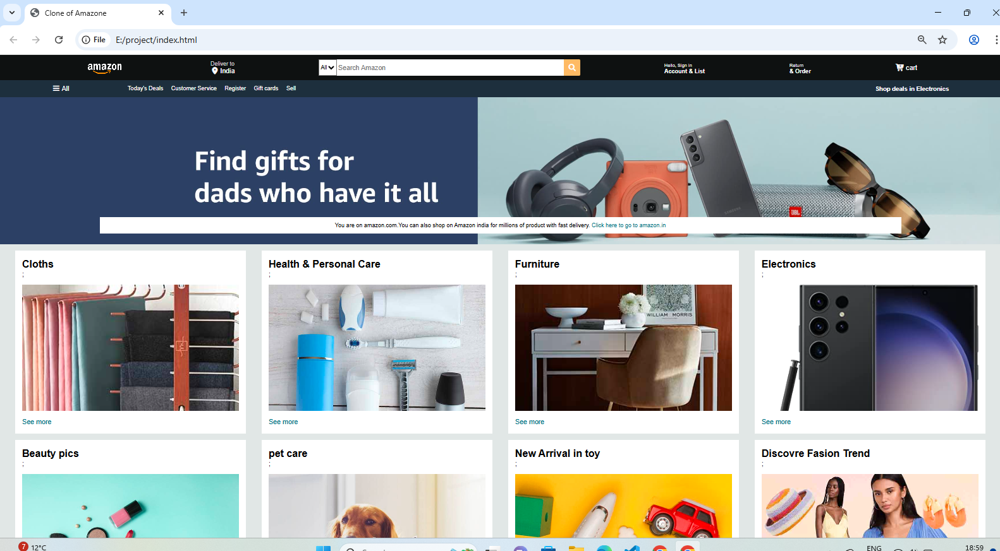
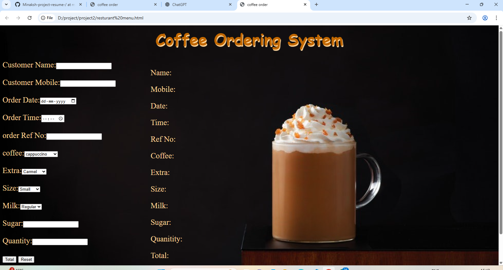

## 👩‍💻 Profile Summary

Front-End Developer fresher with knowledge of HTML, CSS, and basic JavaScript.  
Skilled in creating responsive layouts and beginner-level web projects.  
Eager to learn, improve skills, and start a career in web development.

## 🛠️Skills

- HTML 
- CSS
- JavaScript (Basic)  
- GitHub(Basic)
- MYSQL

## 💻 Projects Highlighted

### 🛒 Amazon Clone (Front-End Project)
- Designed and developed a responsive e-commerce layout  
- Built using **HTML & CSS**  
- Focused on clean UI and user experience  

  

### ☕ Coffee Ordering System
- Web-based coffee ordering interface  
- Built using **HTML, CSS, and JavaScript (Basic)**  
- Interactive UI for ordering flow
- 

   

## 🎓 Education

- **Bachelor’s Degree (Pursuing – 3rd Year)**  
  Dev Samaj College for Women, Chandigarh  
  Punjab University  

- **12th (2022–2023)**  
  Himachal Pradesh Board of School Education  

- **10th (2020–2021)**  
  Himachal Pradesh Board of School Education  

## 🏆 Certificates & Achievements
- 📜 IBM Certificate Course in HTML and CSS 
- 🥇 1st Position – IT Club Tech Wizard Video Contest  
- 🥉 3rd Position – Punjab University Zonal Youth & Heritage Festival  
- 📜 Domestic Data Entry Operator (NSQF Level-2)  

## 🌱 Experience

**Fresher**  
Actively learning front-end development and building projects to improve coding and design skills.

## 🌐 Languages

- Hindi  
- English  

## 📬 Contact

- 📧 Email: minakshi8025@gmail.com  
- 📱 Phone: 9779546620  
- 💼 LinkedIn: www.linkedin.com/in/minakshi-vishva-186653365 

